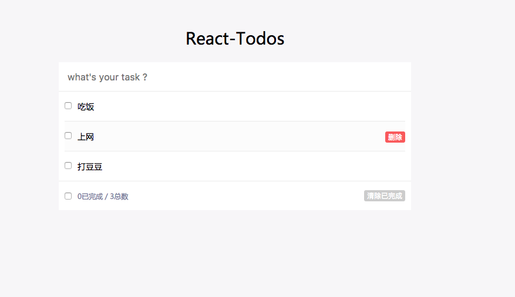

## 技术栈
react + react-dom + localdb + webpack3 + 热更新 + ES6/7 + flex
>localdb主要实现数据持久化

## 项目运行
```
git clone git@github.com:liansky/react-todo.git  

cd react-todo （进入当前的项目）

npm install  (安装依赖包)

npm run dev (运行本地开发环境)

npm run build (打包)

```

## 项目目的
* 熟悉react 、react-dom相关api
* 了解react 组件化开发模式
* 熟悉jsx语法
* 从零搭建webpack开发环境
* 熟悉ES6/7新特性
* 加入react-router4、react-redux

## 待完善
* webpack环境加入编译sass、自动加浏览器前缀
* 加入axios处理前端请求
* async／await异步处理

## 项目截图


## 项目目录
```
|-- README.md
|-- package.json
|-- gitbook
|-- dist                        // 构建生成目录
|-- config                      
|-- |-- conf.js                 // webpack配置文件            
|-- |-- dev-server.js           // 热更新启动入口       
|-- |-- webpack.dev.conf.js     // 开发配置
|-- `-- webpack.prod.conf.js    // 生产配置
|-- src                         
|   |-- assets                  // 静态资源
|   |   |-- fonts
|   |   |-- img
|   |   |   `-- react-todos.png
|   |   `-- style
|   |       |-- main.css
|   |       `-- reset.css
|   |-- component               // 组件
|   |   |-- App.jsx             
|   |   |-- TodoFooter.jsx
|   |   |-- TodoHeader.jsx
|   |   |-- TodoItem.jsx
|   |   `-- TodoMain.jsx
|   |-- main.jsx                // 入口文件
|   |-- redux                   // 状态管理
|   `-- router                  // 路由
|-- static
`-- yarn.lock

```
